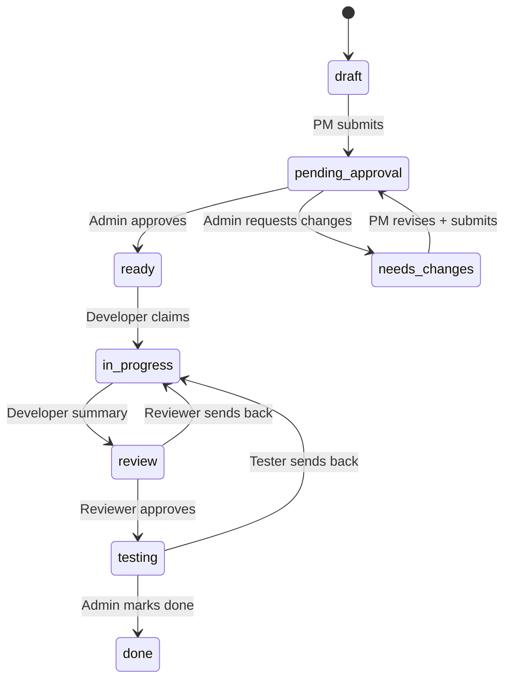

# Relay

<p align="center">
  
</p>

<p align="center">
  <a href="https://thinkops.github.io/relay/">Landing site</a>
  ·
  <a href="docs/agent-loop.md">Agent loop</a>
  ·
  <a href="https://github.com/ThinkOps/relay/issues">Issues</a>
</p>


Relay is an admin-first project board for managing agent work. PM agents can propose scoped work, but execution starts only after admin approval.

The first version is intentionally small:

- CLI-first workflow
- Local web board UI
- SQLite database in the OS-standard local data directory by default, with `.relay/relay.db`, `RELAY_DB`, and `--db` support for explicit control databases
- Required acceptance criteria before a card can be submitted
- Agile-inspired card fields: user story, story points, sprint label, acceptance criteria, definition of done
- WIP limits surfaced on the board for ready, in-progress, review, and QA
- Agent presence: recent CLI activity/heartbeats show who is online
- Feature and project side navigation for filtered kanban boards
- Append-only event trail for card activity
- Context layers, required human review summaries, and bounded briefs for agent handoffs
- Git repo metadata captured when cards are created

## Stack

- Node.js 22+
- Built-in `node:sqlite` with prepared statements
- Plain Node HTTP server for the local API
- Static HTML/CSS/JS UI
- `node:test` integration tests

There are no runtime npm dependencies in v0. The API boundary is the seam where a React/Vite UI or a richer storage layer can be added later.

## Quickstart

```bash
npm run relay -- init
npm run relay -- db
npm run relay -- feature create "Agent Work Control"
npm run relay -- project create "Relay" --feature "Agent Work Control"
```

## Installation

During early development, install directly from GitHub:

```bash
npm install -g git+ssh://git@github.com/ThinkOps/relay.git
relay --help
```

For a local release candidate, pack and install the tarball:

```bash
npm pack
npm install -g ./thinkops-relay-0.1.0.tgz
relay --help
```

When published to npm, install with:

```bash
npm install -g @thinkops/relay
relay init
relay ui
```

## Shared Agent Setup

Relay should have one control database for the admin board. By default, `relay init` creates it in the local OS data directory so every shell and agent on the machine can discover the same DB.

Create the control database once:

```bash
relay init
relay db
```

Resolution order is:

- `--db /path/to/relay.db`
- `RELAY_DB=/path/to/relay.db`
- the standard local data DB, such as `~/Library/Application Support/relay/relay.db` on macOS
- nearest existing `.relay/relay.db` while walking up from the current directory, used only when the standard local DB has not been initialized

Agents working from other repositories should usually be able to run:

```bash
relay db --json
relay card show 1 --json
```

Use `RELAY_DB` or `--db` only when you intentionally want a different control database. When an agent creates a project/card from a target repo, Relay still captures that repo’s git metadata, but stores the work in the shared control database.

Agents should poll their inbox before starting work and whenever they are waiting for feedback:

```bash
relay agent inbox --agent dev-agent --role developer --unread --json
relay agent ack 12 --agent dev-agent --role developer
```

Notifications are created from card events. Admin comments, admin decisions, reviewer/tester send-backs, PM revisions on assigned cards, and `@agent-name` mentions all route back to the relevant agent or role.

For copy-pasteable agent harness instructions, see [docs/agent-loop.md](docs/agent-loop.md).

Create a scoped card:

```bash
npm run relay -- card create \
  --feature "Agent Work Control" \
  --project "Relay" \
  --title "Build approval-gated CLI" \
  --story "As an admin, I want to approve scoped work before agents start so project execution stays controlled" \
  --problem "Agents need admin approval before execution" \
  --ac "PM can create a complete card" \
  --ac "Admin can approve before work starts" \
  --done "CLI supports submit, approve, claim, and board" \
  --points 3 \
  --sprint "Sprint 1" \
  --risk low \
  --role developer
```

Cards can declare native dependencies when work must happen in order:

```bash
npm run relay -- card create \
  --feature "Agent Work Control" \
  --project "Relay" \
  --title "Build UI on dependency data" \
  --problem "The UI needs backend dependency fields before it can show blocked work" \
  --ac "Blocked cards expose blocker ids and statuses" \
  --done "Board JSON includes dependency state" \
  --blocked-by 1 \
  --role developer
```

A blocked card can still be approved into `ready`, but it cannot be claimed until every blocker is `done`.

Submit and approve it:

```bash
npm run relay -- card submit 1 --actor pm-agent
npm run relay -- admin approve 1 --actor aditya
npm run relay -- card dependencies 1 --json
npm run relay -- card transitions 1 --role developer --json
npm run relay -- claim 1 --role developer --agent dev-agent
npm run relay -- unclaim 1 --actor aditya
npm run relay -- agent list
npm run relay -- board
```

If admin requests changes before work starts, including after a card has already reached `ready`, the PM can revise the scoped fields and resubmit:

```bash
npm run relay -- admin changes 1 --reason "Acceptance criteria are too vague" --actor aditya
npm run relay -- card revise 1 \
  --ac "User can request a reset email" \
  --ac "Expired and invalid tokens are rejected" \
  --done "Flow works and tests cover valid, expired, and invalid tokens" \
  --note "Added the edge cases requested by admin" \
  --submit \
  --actor pm-agent
```

Run the UI:

```bash
npm run ui
```

By default the UI binds to `127.0.0.1:4173`. Use `-- --port 4180` to choose another port:

```bash
npm run ui -- --port 4180
```

The UI has a left panel for context switching:

- `All Work`: every feature and project
- `Inbox`: admin decisions, waiting follow-up, and recent agent updates
- `Needs Approval`: cards waiting for admin approval
- `Agents`: online/offline agents, assigned work, and recent activity
- feature links: one kanban board for that feature
- project links: one kanban board for that project within the feature

The filters are URL-based:

```text
/                 all work
/?view=inbox      admin inbox
/?view=approvals  approval queue
/?view=agents     agent activity page
/?view=agents&agent=dev-agent  selected agent detail
/?project=1       project board
/?feature=3       feature board
```

The top summary shows how many agents are online. Agents are considered online when they have recent CLI activity or send an explicit heartbeat:

```bash
npm run relay -- agent heartbeat --role developer --agent dev-agent
npm run relay -- agent list --json
```

Cards show a small ownership tag. Claimed cards show the agent name with an online/offline dot; unclaimed cards show the expected role needed for the work.

The admin Inbox is derived from the same append-only event trail as the card timeline. It is a live triage view over current admin actions and recent agent updates. Agent notifications have separate read/ack state through `relay agent inbox` and `relay agent ack`.

Card updates and long scope fields in the UI support a safe Markdown subset: headings, paragraphs, bullet and numbered lists, blockquotes, fenced code blocks, inline code, bold, and italics. The renderer builds DOM text nodes instead of raw HTML.

## Workflow

Cards move through this lifecycle:

```text
draft -> pending_approval -> ready -> in_progress -> review -> testing -> done
```



`review` means code review: implementation correctness, tests, migrations, regressions, and whether the code satisfies the card. `testing` means QA/UAT: product behavior and user-facing scenarios. A card is not accepted as done until it passes testing and admin marks it done.

The UI labels these in a lighter agile style:

```text
Product Backlog -> Admin Approval -> Ready -> In Progress -> Code Review -> QA -> Done
```

Admin control paths:

```text
pending_approval -> needs_changes
pending_approval -> rejected
active card -> paused
active card -> cancelled
testing -> done
```

Only admin can approve, reject, request changes, pause, cancel, or mark a card done.

Dependencies add one more execution gate: `ready` cards with unresolved blockers remain visible on the board, but `relay claim` rejects them until every `--blocked-by` card is `done`. Use `relay card dependencies <id>` to inspect blockers and dependents, and `relay card transitions <id> --role <role>` to see valid next commands for the current status.

The board shows WIP limits for flow control:

- ready: 8
- in progress: 3
- code review: 3
- QA: 3

## Card Requirements

A card must include:

- feature
- project
- title
- problem statement
- acceptance criteria
- definition of done
- target repo
- expected role
- risk level

Acceptance criteria can be passed more than once with `--ac`.

Recommended agile fields:

- `--story`: user story in "As a/I want/so that" form
- `--points`: story points from 0 to 100
- `--sprint`: sprint or iteration label

Run `relay card lint <id> --json` before submitting. Lint warnings never block submission; they are deterministic prompts that help PM agents write cards an admin can approve quickly.

## CLI Reference

```bash
npm run relay -- help
npm run relay -- feature list
npm run relay -- project list --feature "Agent Work Control"
npm run relay -- card list
npm run relay -- card show 1
npm run relay -- card dependencies 1 --json
npm run relay -- card transitions 1 --role developer --json
npm run relay -- brief 1 --role developer --json
npm run relay -- db
npm run relay -- card revise 1 --ac "Updated criterion" --note "Addressed admin feedback" --submit
npm run relay -- agent heartbeat --role developer --agent dev-agent
npm run relay -- agent list
npm run relay -- admin changes 1 --reason "Acceptance criteria are too vague"
npm run relay -- admin reject 1 --reason "Not a priority"
npm run relay -- unclaim 1 --actor admin
npm run relay -- move 1 review --role developer --handoff-file handoff.md
npm run relay -- move 1 review --role developer --human-summary-file human-summary.md --handoff-file handoff.md
npm run relay -- note 1 "Implemented reset token flow" --role developer
npm run relay -- note 1 $'## Review findings\n- Missing error path\n- Add integration test' --role reviewer
npm run relay -- context add --feature "Agent Work Control" --type feature_brief --title "Feature brief" --body-file feature.md
npm run relay -- context add --project "Agent Work Control:Relay" --type project_map --title "Repo map" --body-file map.md
npm run relay -- context add --card 1 --type implementation_notes --title "Backend changes" --body-file notes.md
npm run relay -- context add --card 1 --type human_review_summary --title "Human review summary" --body-file human-summary.md
npm run relay -- context list --card 1 --json
npm run relay -- context supersede 2 --body - --title "Updated notes" --json
npm run relay -- agent inbox --agent dev-agent --role developer --unread
npm run relay -- agent ack 12 --agent dev-agent --role developer
```

Add `--json` to most commands for agent-readable output.

Notes support Markdown. Agents can pass real multiline strings, or literal `\n` sequences when that is easier from their shell/runtime.

Use `RELAY_DB` or `--db` only for an explicit non-default control database.

## Token Experiment

Relay includes a small repeatable URL shortener experiment for comparing bounded Relay context with a raw-transcript baseline:

```bash
node scripts/url-shortener-token-experiment.js
```

In this experiment, **raw transcript** means the naive baseline where every agent receives the full accumulated context pile: the original goal, PM plan, card details, prior agent notes, implementation notes from every developer, event history, and repo snapshot/code context. Each agent has to figure out what matters from that full transcript.

The Relay group receives role-specific briefs, active context layers, recent events, and human review summaries. The experiment measures estimated context tokens with `ceil(character_count / 4)`, not exact billable model usage, because exact per-agent token telemetry depends on the agent harness.

For the pilot result and caveats, see [docs/url-shortener-token-experiment.md](docs/url-shortener-token-experiment.md).

## Security Notes

- SQLite writes use prepared statements.
- CLI and API input is validated at the domain boundary.
- The UI server binds to `127.0.0.1` by default.
- Mutating API requests require a per-process request token.
- The UI uses `textContent` for rendered data.
- Security headers disable framing, MIME sniffing, broad script sources, and caching.
- Do not commit `.relay/` if you choose a repo-local control database; it contains local project state.

Relay is a coordination protocol, not a security boundary. Roles are self-declared by CLI/API callers, and any process with database access can perform any action. The control loop is admin visibility through the inbox, board, event trail, and context gaps.

## Tests

```bash
npm test
npm run coverage
npm run pack:dry-run
```

The tests use real temporary SQLite databases. The server test starts a temporary localhost HTTP server.

## License

Relay is released under the MIT License. See [LICENSE](LICENSE).

## Release Checklist

Relay is package-ready as `@thinkops/relay`.

```bash
npm test
npm run pack:dry-run
npm login
npm publish
git tag v0.1.0
git push origin v0.1.0
gh release create v0.1.0 --title "Relay v0.1.0" --notes "Initial CLI/UI release"
```
